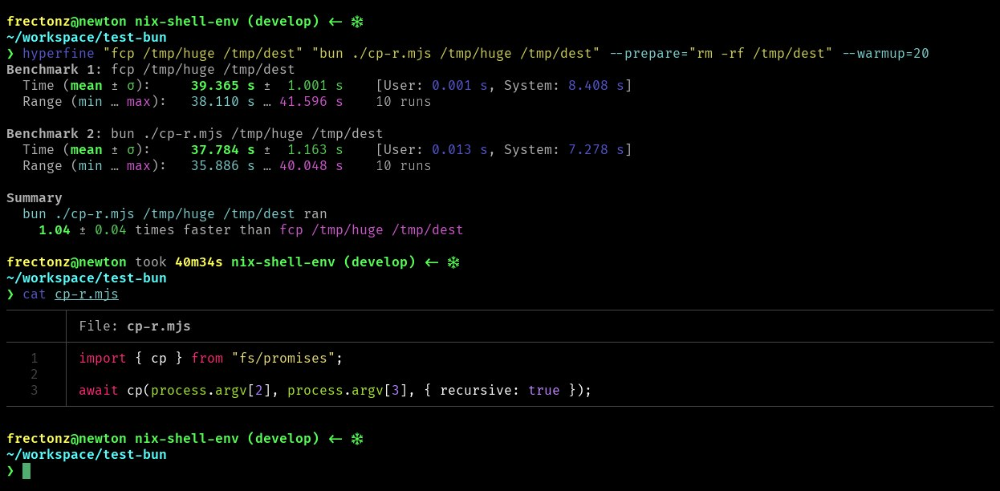
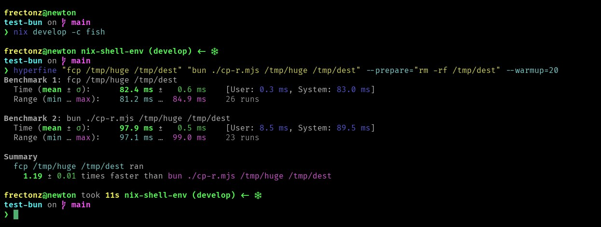
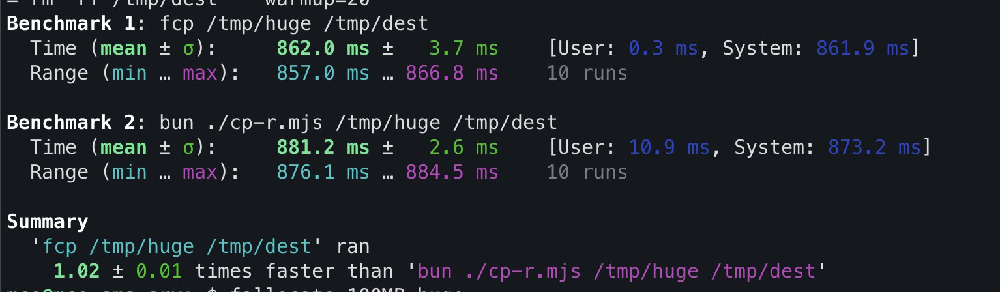
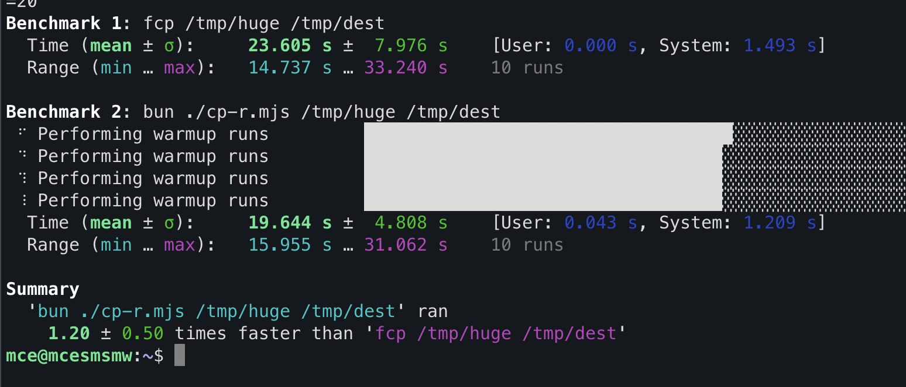
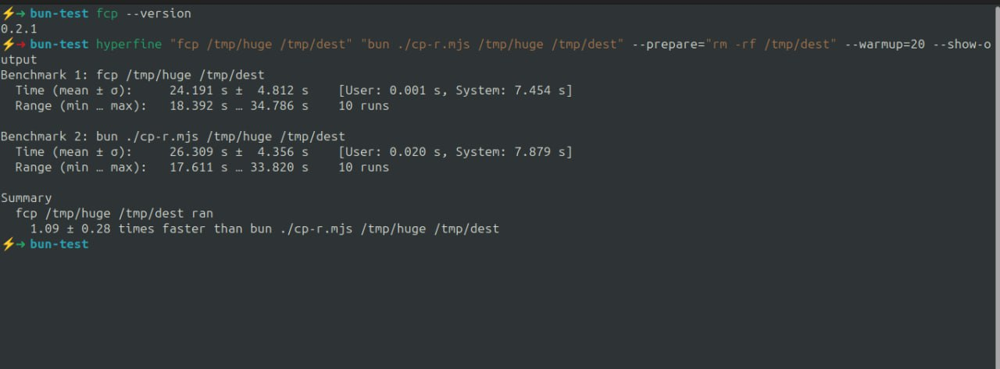
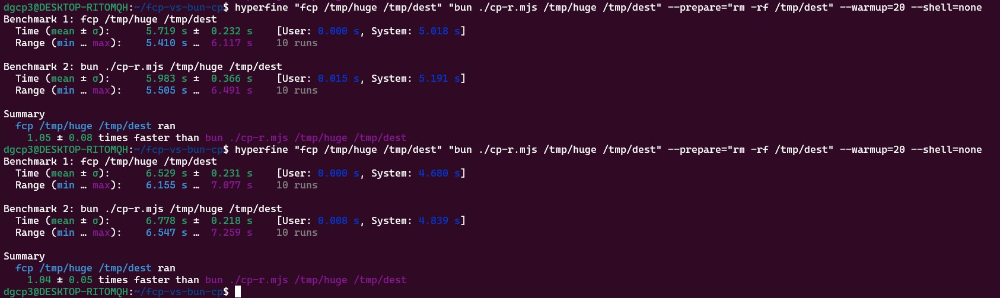

# `fcp` vs `bun cp`

If you have nix installed, this command will install `bun`, `fcp` and `hyperfine`.

```bash
nix develop
```

The test command is this. Don't forget to have a large file in `/tmp/huge`.

```bash
hyperfine "fcp /tmp/huge /tmp/dest" "bun ./cp-r.mjs /tmp/huge /tmp/dest" --prepare="rm -rf /tmp/dest" --warmup=20
```

# Context

This repo was created to test [Jarred Sumner's](https://twitter.com/jarredsumner/status/1697106543920271524) (creator of bun) claim that bun's `cp` implementation is faster than the rust based `fcp` in this [tweet](https://twitter.com/jarredsumner/status/1697106543920271524).

# Sample Runs

`bun` `1.04x` faster than `fcp`



----
`fcp` `1.19x` faster than `bun`



---
`fcp` `1.02x` faster than `bun`



---
`bun` `1.20x` faster than `fcp`



---
`fcp` `1.09x` faster than `bun`



---
`fcp` `1.04x` faster than `bun`


